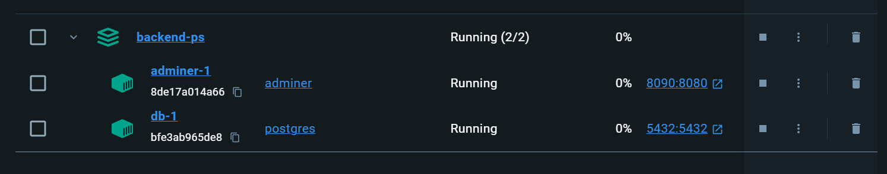

# Databases Setup Guide

To create the database simply clone this repository and do these command:
1. `git clone git@github.com:projets-fin-bac-24/database-setup.git` or `git clone https://github.com/projets-fin-bac-24/database-setup.git`
2. Run this in a terminal: `docker compose -f .\db-compose.yml up -d`

And that's it, you have a database running on your machine! This will look a bit like this:

## Access using Adminer

To access the adminer, navigate to `localhost:8090` and use the following credentials:
- System: `PostgreSQL`
- Server: `docker.host.internal`
- Username: `$POSTGRES_USER`
- Password: `$POSTGRES_PASSWORD`
- Database: `$POSTGRES_DB`

